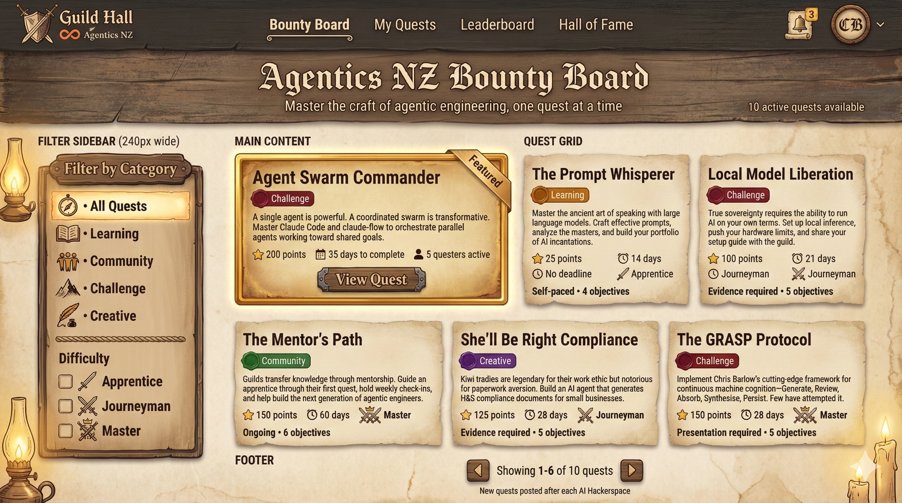
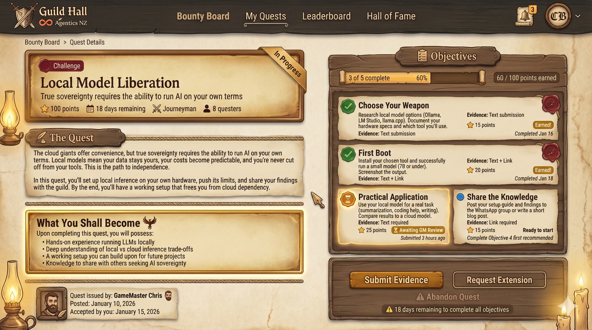
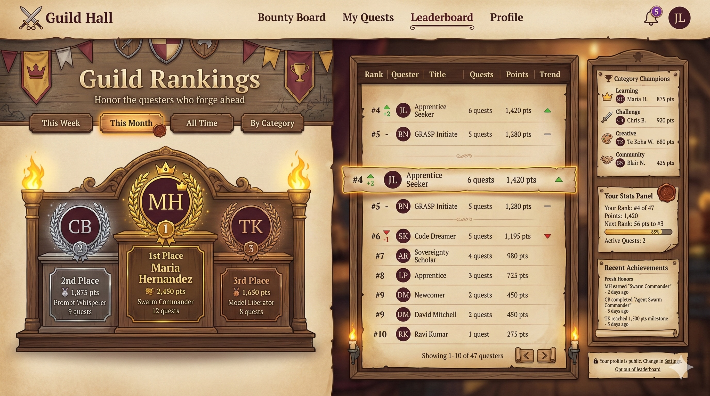
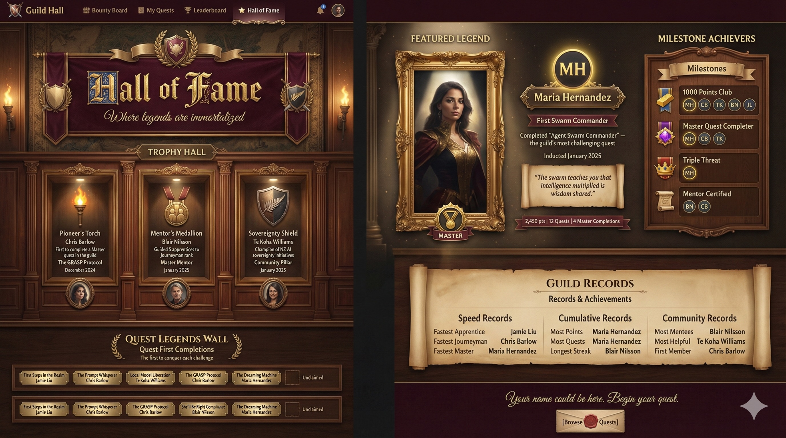
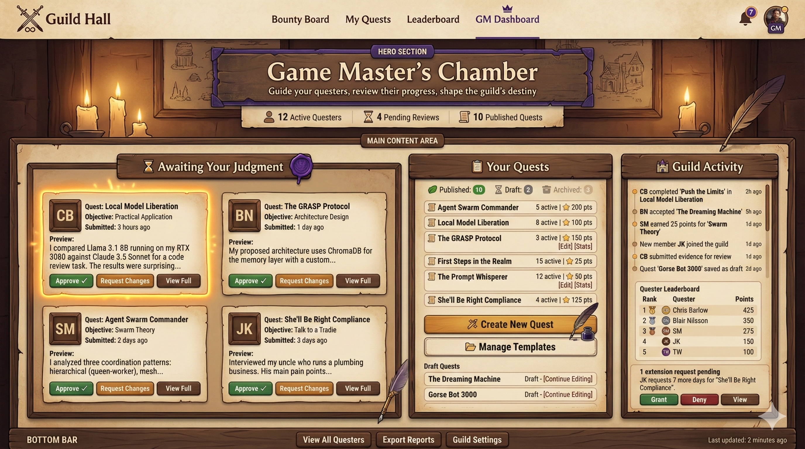

# Guild Hall

> *Transform goals into adventures*

Guild Hall is a quest-based engagement platform where Game Masters (GMs) create quests for community members to accept and complete. Built on the philosophy that **quests are adventures, not checklists**.

---

## The Concept

Traditional goal-setting feels like obligation. Quests reframe achievement as adventure:

- **Obstacles** become expected parts of the journey
- **Challenges** become opportunities for growth
- **Progress** becomes visible and rewarding
- **Completion** becomes transformation, not just a checkbox

GMs design quests with objectives, deadlines, and rewards. Users browse the **Bounty Board**, accept quests that resonate, submit evidence of completion, and earn recognition for their achievements.

---

## Preview

> *Mockup images to be generated from prompts in `docs/mock-ups/`*

### Bounty Board

*Browse available quests, filter by category and difficulty, see featured challenges.*

### Quest Detail

*Track progress through objectives, submit evidence, earn points.*

### Leaderboard

*Compete for rankings, track progress, celebrate top questers.*

### Hall of Fame

*Permanent recognition for legendary achievements and quest firsts.*

### GM Dashboard

*Review submissions, manage quests, monitor guild activity.*

---

## V1 Features

### For Users (Questers)
- Browse available quests on the Bounty Board
- Accept quests and track progress
- Complete objectives with evidence submission (text, links)
- Request deadline extensions when needed
- Earn points, badges, and leaderboard ranking
- Control privacy settings (profile visibility, leaderboard opt-out)
- Export personal data (JSON)

### For Game Masters
- Create quests with multiple objectives
- Configure objective dependencies (linear or flexible)
- Set acceptance and completion deadlines
- Review evidence submissions (approve/reject with feedback)
- Manage deadline extension requests
- Save quests as templates for reuse
- View all user progress

### Authentication
- Email/password
- Google OAuth
- Apple OAuth

---

## Tech Stack

| Layer | Technology |
|-------|------------|
| Frontend | Next.js 14 (App Router) |
| Hosting | Netlify |
| Backend | Supabase (PostgreSQL, Auth, Realtime) |
| Styling | Tailwind CSS |
| UI Components | shadcn/ui |
| State | React Query |

See [Architecture Decision Records](docs/adrs/) for detailed rationale.

---

## Documentation

### Planning & Strategy
| Document | Description |
|----------|-------------|
| [North Star](docs/NORTH-STAR.md) | Vision, mission, and guiding principles |
| [Roadmap](docs/ROADMAP.md) | V1, V2, V3 feature planning |
| [Requirements](docs/REQUIREMENTS.md) | Functional and non-functional requirements |

### Implementation
| Document | Description |
|----------|-------------|
| [Implementation Plan](docs/IMPLEMENTATION-PLAN.md) | Phased build plan with deliverables |

### Architecture Decisions
| ADR | Decision |
|-----|----------|
| [ADR-001](docs/adrs/ADR-001-Frontend-Framework.md) | Next.js for frontend |
| [ADR-002](docs/adrs/ADR-002-Hosting-Platform.md) | Netlify for hosting |
| [ADR-003](docs/adrs/ADR-003-Backend-Platform.md) | Supabase for backend |
| [ADR-004](docs/adrs/ADR-004-Styling.md) | Tailwind CSS for styling |
| [ADR-005](docs/adrs/ADR-005-UI-Components.md) | shadcn/ui for components |
| [ADR-006](docs/adrs/ADR-006-State-Management.md) | React Query for state |
| [ADR-008](docs/adrs/ADR-008-Role-Based-Access-Control.md) | Custom roles with RLS |
| [ADR-009](docs/adrs/ADR-009-Smart-Quest-Creator.md) | AI-assisted quest creation (V2) |

### Technical Specifications
| Spec | Description |
|------|-------------|
| [SPEC-001](docs/specs/SPEC-001-Database-Schema.md) | PostgreSQL database schema |
| [SPEC-002](docs/specs/SPEC-002-Row-Level-Security.md) | Row Level Security policies |
| [SPEC-003](docs/specs/SPEC-003-Authentication-Flows.md) | Authentication implementation |
| [SPEC-004](docs/specs/SPEC-004-Realtime-Notifications.md) | Real-time notification system |
| [SPEC-005](docs/specs/SPEC-005-Leaderboard-Privacy-Rules.md) | Leaderboard and privacy rules |
| [SPEC-006](docs/specs/SPEC-006-Smart-Quest-Creator.md) | Smart Quest Creator (V2) |

---

## Reference Guilds

Guild Hall supports multiple guilds, each with their own themes, quests, and communities. Reference guilds demonstrate quest design patterns and best practices.

### Agentics NZ Guild

The **Agentics NZ Guild** is the first reference implementation, focused on building sovereign AI capability in New Zealand. This guild demonstrates:

- **Difficulty progression**: Apprentice → Journeyman → Master quests
- **Category variety**: Learning, Challenge, Creative, Community
- **Objective dependencies**: Linear, parallel, and hybrid structures
- **Evidence types**: Self-certified, text, links, and demos
- **NZ-specific context**: Te Tiriti, local industry, regional challenges

| Resource | Description |
|----------|-------------|
| [Guild Reference](docs/guilds/agentics-nz/GUILD-REFERENCE.md) | Comprehensive profile for quest design |
| [Example Quests](docs/guilds/agentics-nz/quests/) | 10 quests spanning all difficulty levels |
| [Quest Design Spec](docs/specs/SPEC-007-Guild-Reference-Builder.md) | How guild references are built |

#### Example Quest Summary

| Quest | Category | Difficulty | Points |
|-------|----------|------------|--------|
| [First Steps in the Realm](docs/guilds/agentics-nz/quests/01-first-steps-in-the-realm.md) | Learning | Apprentice | 25 |
| [The Prompt Whisperer](docs/guilds/agentics-nz/quests/02-the-prompt-whisperer.md) | Challenge | Apprentice | 50 |
| [Local Model Liberation](docs/guilds/agentics-nz/quests/03-local-model-liberation.md) | Challenge | Journeyman | 100 |
| [The GRASP Protocol](docs/guilds/agentics-nz/quests/04-the-grasp-protocol.md) | Learning | Master | 150 |
| [She'll Be Right Compliance](docs/guilds/agentics-nz/quests/05-shells-be-right-compliance.md) | Creative | Journeyman | 125 |
| [The Dreaming Machine](docs/guilds/agentics-nz/quests/06-the-dreaming-machine.md) | Challenge | Master | 175 |
| [Sovereign Data, Sovereign AI](docs/guilds/agentics-nz/quests/07-sovereign-data-sovereign-ai.md) | Learning | Journeyman | 75 |
| [Agent Swarm Commander](docs/guilds/agentics-nz/quests/08-agent-swarm-commander.md) | Challenge | Master | 200 |
| [The Mentor's Path](docs/guilds/agentics-nz/quests/09-the-mentors-path.md) | Community | Master | 150 |
| [Gorse Bot 3000](docs/guilds/agentics-nz/quests/10-gorse-bot-3000.md) | Creative | Master | 200 |

---

## Getting Started

### Prerequisites
- Node.js 18+
- npm or yarn
- Supabase account

### Installation

```bash
# Clone the repository
git clone https://github.com/your-org/guild-hall.git
cd guild-hall

# Install dependencies
npm install

# Copy environment template
cp .env.example .env.local

# Add your Supabase credentials to .env.local
# NEXT_PUBLIC_SUPABASE_URL=your-project-url
# NEXT_PUBLIC_SUPABASE_ANON_KEY=your-anon-key
```

### Database Setup

```bash
# Run migrations against your Supabase project
# (Migration files in supabase/migrations/)
```

### Development

```bash
# Start development server
npm run dev

# Open http://localhost:3000
```

### Deployment

The app deploys to Netlify on push to `main`. Configure environment variables in Netlify dashboard.

---

## Project Structure

```
guild-hall/
├── app/                    # Next.js App Router pages
│   ├── (auth)/            # Authentication pages
│   ├── (dashboard)/       # User dashboard pages
│   └── (gm)/              # Game Master pages
├── components/            # React components
│   ├── ui/               # shadcn/ui components
│   └── ...               # Feature components
├── lib/                   # Utilities and configurations
│   └── supabase/         # Supabase client setup
├── contexts/              # React contexts
├── docs/                  # Documentation
│   ├── adrs/             # Architecture Decision Records
│   └── specs/            # Technical specifications
└── supabase/             # Database migrations and seeds
```

---

## V1 Scope

Guild Hall V1 focuses on the core quest loop:

**Create → Accept → Complete → Review → Reward**

### Included
- Solo quests only
- Text and link evidence
- In-app notifications
- Basic rewards (points, badges, leaderboard)

### Deferred to V2+
- Party/shared quests
- Photo/video evidence
- Email/push notifications
- Smart Quest Creator (LLM-assisted)
- Multi-guild support

See [Roadmap](docs/ROADMAP.md) for version planning.

---

## Contributing

*Contribution guidelines coming soon.*

---

## License

*License TBD*

---

## Acknowledgments

Built with inspiration from:
- [Do Quests, Not Goals](https://www.raptitude.com/2024/08/do-quests-not-goals/) by David Cain
- Quest-based experience design principles

---

*"Every quest has a dragon. When you finally face it, victory is closer than you think."*
